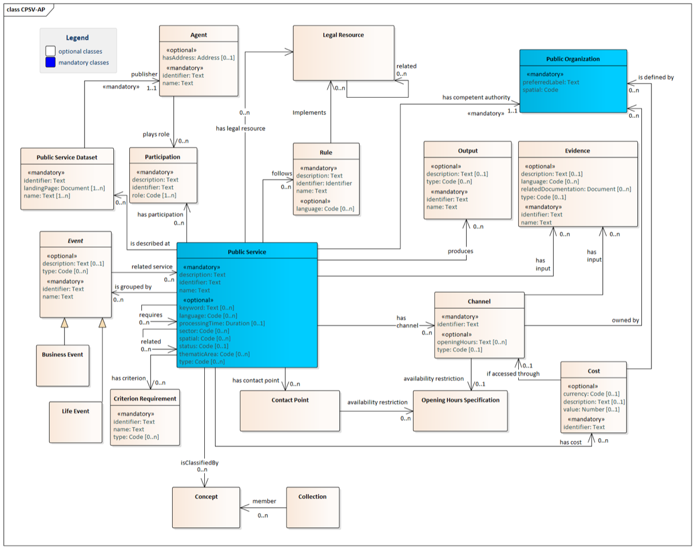

# C4C_cpsv_ap

One of the goals is to export the data to open linked data format.

This can be separated into subproblems:

* Convert website to **Machine Readable** data.
* Extract relevant information.
* Save as RDF.

  
  *Core Public Service Vocabulary Application Profile*

For all information related to CPSV-AP
see [Core Public Service Vocabulary Application Profile solution](https://joinup.ec.europa.eu/collection/semantic-interoperability-community-semic/solution/core-public-service-vocabulary-application-profile/releases)

## Validation

For validation of the RDF, we currently refer
to [https://www.itb.ec.europa.eu/shacl/cpsv-ap/upload](https://www.itb.ec.europa.eu/shacl/cpsv-ap/upload).

Validation of the data (07/10/2011):

* data/output/demo2_export.rdf: property dct:spatial has to be added to PublicOrganisations.
* data/examples/trento.jsonld: flawless
* data/examples/export.rdf: "The property dct:language SHOULD have the following pattern"

# TODO

*[ ] Extract and save basic functionalities
    * Opening hours
    * Evidence
    * Criterion Requirements
    * Contact Point

# Packages

Get python RDF parser for SKOS:Concepts

    pip install git+https://github.com/CrossLangNV/DGFISMA_RDF@development

Example code to generate RDFLib graph for the concepts:

    from concepts.build_rdf import ConceptGraph

    ConceptGraph(['term 1', 'term 2'])

# Data

* Dienstencataloog
  Vlaanderen [https://data.vlaanderen.be/doc/applicatieprofiel/dienstencataloog/](https://data.vlaanderen.be/doc/applicatieprofiel/dienstencataloog/)

    * example RDF
      [https://data.vlaanderen.be/context/dienstencataloog.jsonld](https://data.vlaanderen.be/context/dienstencataloog.jsonld)

* [https://github.com/catalogue-of-services-isa/RDF_transformation](https://github.com/catalogue-of-services-isa/RDF_transformation)

# Other sources

The following services are found
on [https://github.com/catalogue-of-services-isa](https://github.com/catalogue-of-services-isa)

* Still have to check it, but a harvester for CPSV-AP data.
  [https://github.com/catalogue-of-services-isa/cpsv-ap_harvester](https://github.com/catalogue-of-services-isa/cpsv-ap_harvester)

* [cpsv-ap_validator](https://github.com/catalogue-of-services-isa/cpsv-ap_validator): Got it up and running. Has a nice
  document in doc/ that explains well the content of CPSV models. Usefulness will come when we have our own data.

* [https://github.com/catalogue-of-services-isa/Trento_conversionToRDF](https://github.com/catalogue-of-services-isa/Trento_conversionToRDF)
  RDF data from Trento, Italy.

* Example of API around the
  RDF: [http://cpsv-ap.semic.eu:8890/cpsv-ap_editor/browse-all-content](http://cpsv-ap.semic.eu:8890/cpsv-ap_editor/browse-all-content)