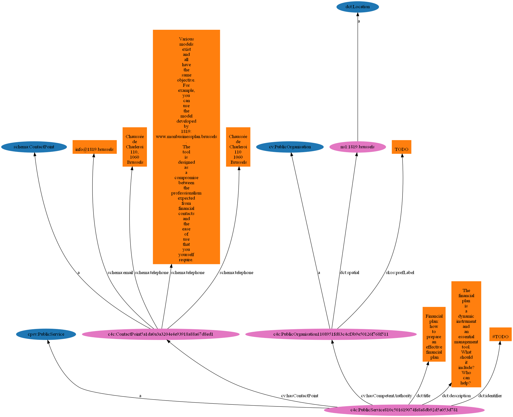

# Relation extraction

CLI

## Demo

Go into the container
> docker compose run cpsv_ap bash

Move to scripts folder
> cd scripts

Run relation extraction. E.g.
> python extract_cpsv_ap.py -g -o DEMO_BELGIUM_GENERAL.rdf -l NL -c BE -m aalter.be DEMO_PROCEDURE.html

Useful commands:

- help
  > python extract_cpsv_ap.py -h

# Make an image of the graph

## RDF Grapher

[https://www.ldf.fi/service/rdf-grapher](https://www.ldf.fi/service/rdf-grapher)

Make sure to enable: 'Send form as HTTP POST (needed for large RDF data)'

## Graphviz

! Only if above is not working.

To visualise, and be able to run the above scrpit, Graphviz has to be installed and added to your path.
See https://graphviz.org/ for install instruction.

1. Make a Graphviz file

    1. https://github.com/fatestigma/ontology-visualization
   > python ./ontology_viz.py -o example_html_extraction.dot example_html_extraction_cpsv-ap.rdf
    <!-- -O ontology.ttl -->
    2. OR https://www.easyrdf.org/converter. example.gv. is made by

2. Convert Graphiv to Image

   The raw RDF data is uploaded and for export format you chose Graphviz.

   > dot -Tpng example.gv -o file.png

   > dot -Tpng example_html_extraction.py.dot -o example_html_extraction.png

