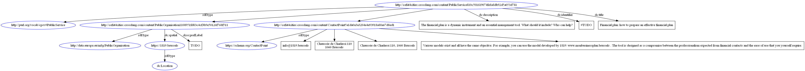

# Make an image of the graph

1. Make a Graphviz file

   example.gv is made by https://www.easyrdf.org/converter.

2. Convert Graphiv to Image

   The raw RDF data is uploaded and for export format you chose Graphviz.

   > dot -Tpng example.gv -o file.png

## Graphviz

To visualise, and be able to run the above scrpit, Graphviz has to be installed and added to your path.
See https://graphviz.org/ for install instruction.

